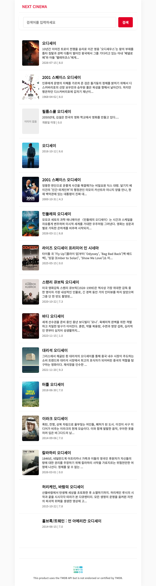

# Next.js Pages Router 영화 서비스 완성본

26번 토픽에서 단계별로 만드는 영화 서비스의 최종 상태입니다. Pages Router의 파일 기반 라우팅과 데이터 패칭 전략을 적용하고 Vanilla Extract로 화면을 구성합니다.

## 완성 화면

### 홈


### 검색



### 상세


## 구현 내용

- Pages Router 기반 홈·검색·영화 상세·404 페이지
- Vanilla Extract를 사용한 전역·레이아웃·컴포넌트 스타일
- SSR, SSG, ISR과 On-Demand ISR 데이터 패칭 예제
- API Routes와 재생성 API의 메서드·토큰·경로 검증
- 페이지별 제목과 description 메타데이터

## 실행하기

먼저 지원 백엔드를 `http://localhost:5005`에서 실행합니다. 그다음 환경 변수 파일을 준비하고 완성본을 실행합니다.

```bash
cp .env.example .env.local
pnpm install
pnpm dev
```

브라우저에서 다음 경로를 확인합니다.

- `http://localhost:3000`: 홈
- `http://localhost:3000/search?q=인셉션`: 검색
- `http://localhost:3000/movies/1`: 상세

프로덕션 동작을 확인할 때도 지원 백엔드를 실행한 상태로 유지합니다.

```bash
pnpm build
pnpm start
```

이 저장소는 최종 결과 확인용 completed입니다. 수업에서는 빈 폴더에서 프로젝트를 생성하고 각 단계를 순서대로 구현합니다.
